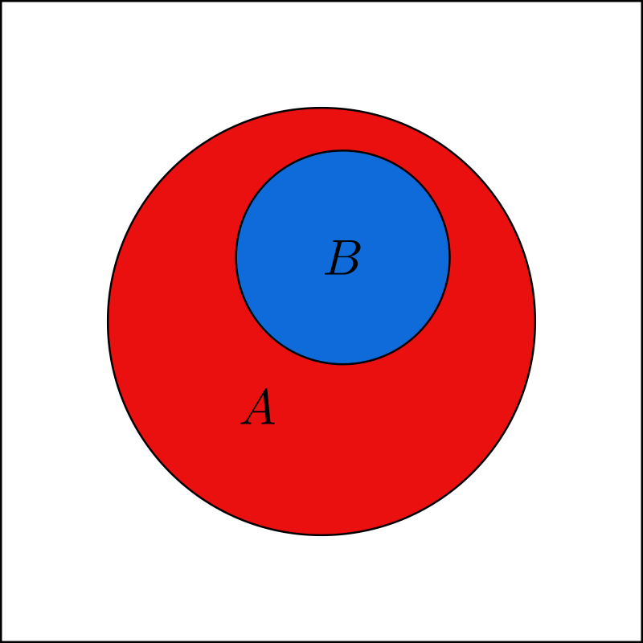
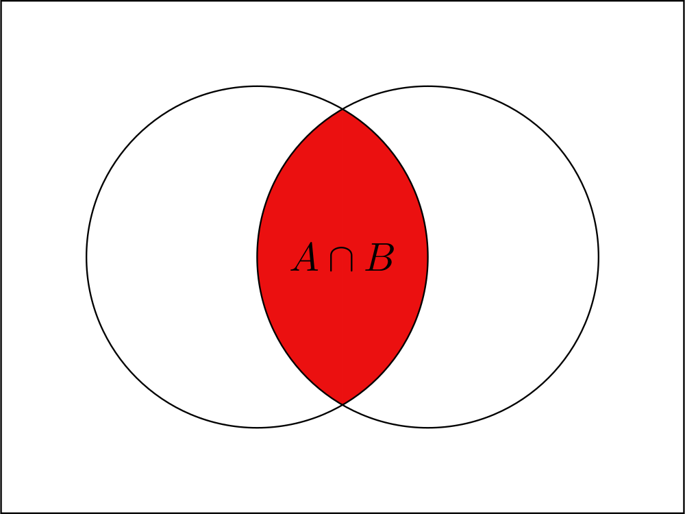
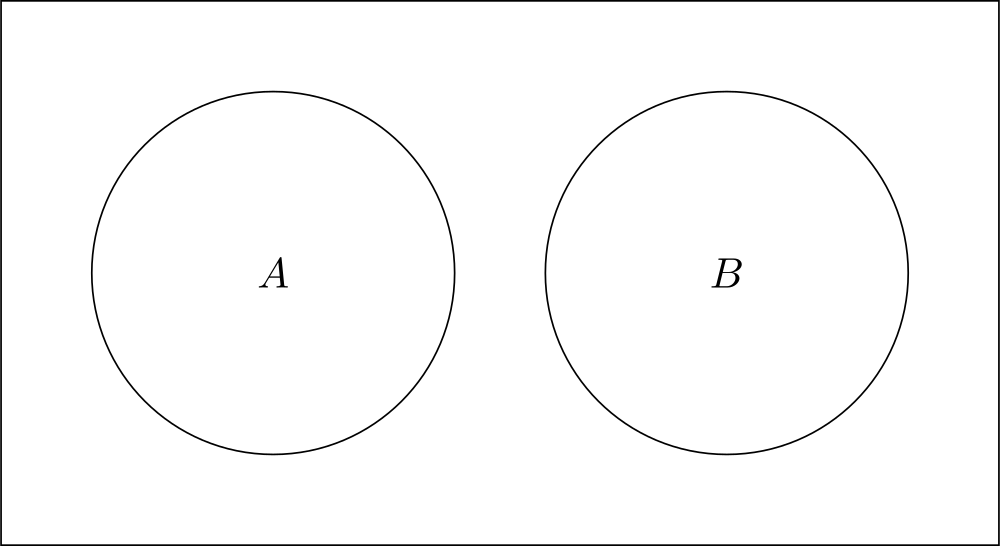
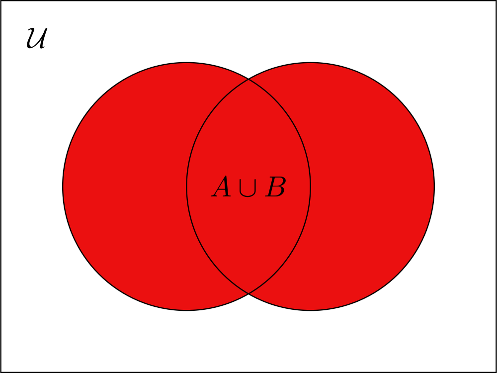
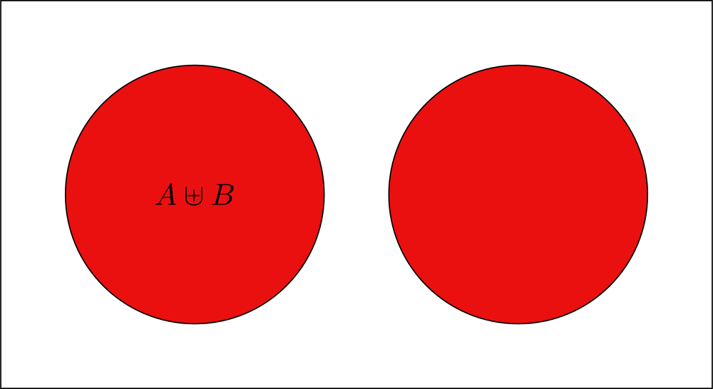
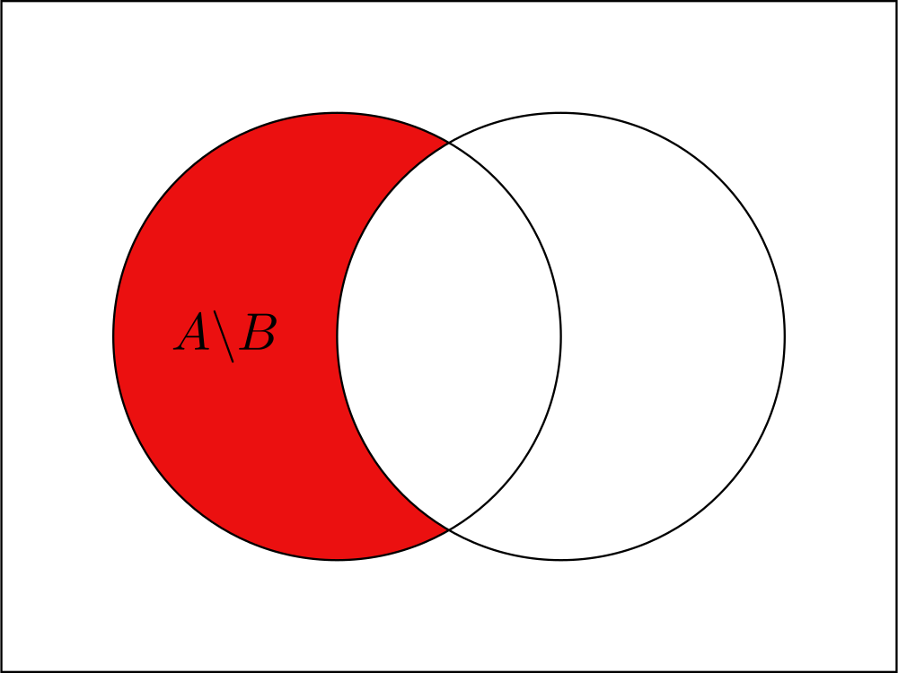
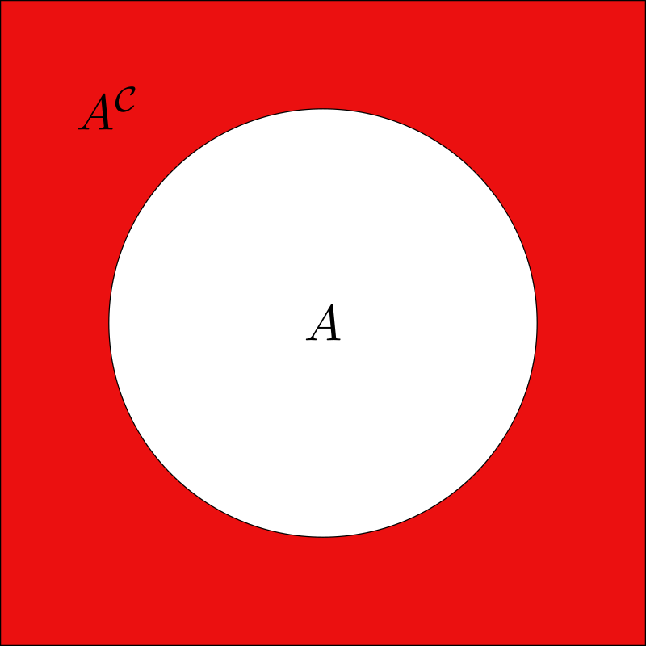
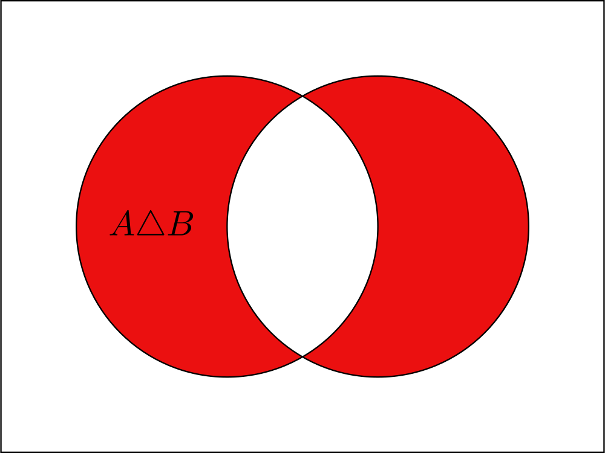

!!! warning "This page is still under construction"

In set theory, the central object we study is (surprisingly) sets. Despite being the central object in the field, this course will not give formal definitions of this object. This is because mathematics, like any branch, is based on definitions and axioms that we agree are correct and from there we progress. Therefore, here we will use sets naively and intuitively without delving into the axioms according to which they behave. (But this is no excuse for non-formalism! Everything will still be formal and precise.)

!!! mnote "_Note_: Domain of Discourse in Set Theory"

    In this field and in most of mathematics the domain of discourse is "Set Theory" itself, meaning all objects we talk about are sets, hence we will not include the domain of discourse in proofs anymore.

!!! mnote "_Note_: Base Assumptions"

    All logic in this chapter is based on a system of axioms called $\mathrm{ZF}$, beyond this chapter we will always use the axiom system $\mathrm{ZFC}$ (we assume the axiom of choice in this course).

## Sets

!!! def "_Definition_: Set (Non formal)"

    A set is a collection of elements without importance for order and without repetitions, it is commonly denoted by curly brackets $\{\}$ between which are all the elements belonging to the set, or if all the elements cannot be listed, a certain rule for creating the elements.

### Set Construction Schemes

Now given what a set **is**, we want to understand how to construct sets.

There are three ways to define/build a set in set theory, the "Listing Method", the "Schema of Separation" and the "Set-Builder Notation using a Formula".

#### Listing Method

The first method is the most straight-forward one, and just consist of defining a list of elements.

!!! def "_Definition_: Listing Method"

    Let $a_1, \ldots, a_n$ be objects, then we can build a set as,

    $$\{a_1, \ldots, a_n\}$$

    ??? mnote "_Note_"

        The "listing form" may also be called "roster form", "tabular form" or "extensional definition".

!!! mexample "_Example_"

    We can build the following sets,

    - $\left\{1, \ldots, 100\right\}$ (Note that the use of ellipses in the definition of a set is prohibited unless the pattern is clear!)
    - $\left\{ \left\{ 1\right\} ,\left\{ 2\right\} \right\}$

!!! def "_Definition_: Singleton"

    A singleton is a set with only one element.

    Formally, let $a$ be an object, then the set $\{a\}$ is called a singleton.

!!! def "_Definition_: Element Belongs to a Set Constructed Using the Listing Method"

    Let $a_1, \ldots, a_n$ be objects, and let $a$ be an object, such that,

    $$\exists i.a=a_{i}$$

    then we say that "$a$ belongs to $\{a_1, \ldots, a_n\}$", and notate it using $a \in \{a_1, \ldots, a_n\}$.

    ??? mnote "_Note_"

        We also use this equivalent phrases,

        - $a$ is in $\{a_1, \ldots, a_n\}$.
        - $a$ is a member of $\{a_1, \ldots, a_n\}$.

!!! mexample "_Example_"

    Those are some examples on "belonging to a set",

    - $1 \in \{1\}$
    - $\left\{ 1\right\} \in\left\{ \left\{ 1\right\} ,\left\{ 2\right\} ,1,2\right\}$
    - $\left\{ 2,2\right\} \in\left\{ \left\{ 2\right\} \right\}$

#### Schema of Separation

The second method is actually an axiom in the $\mathrm{ZF}$ axioms, and it what allows us to create sets from existing sets using a rule.

!!! axiom "_Axiom_: Schema of Separation"

    

    Let $A$ be a set, and let $\varphi$ be a predicate over $A$, then we can build a set as,

    $$\{x\in A\mid \varphi\left(x\right)\}$$

    ??? mnote "_Note_"

        The "schema of separation" may also be called "schema of specification", "schema of restricted comprehension" or "set-builder notation".

!!! def "_Definition_: Element Belongs to a Set Constructed Using the Schema of Separation"

    

    Let $A$ be a set, let $\varphi$ be a predicate over $A$, and let $a$ be an object, such that,

    $$\left(a\in A\right)\land\phi\left(a\right)$$

    then we say that "$a$ belongs to $\left\{ x\in A\mid\phi\left(x\right)\right\}$", and notate it using $a \in \left\{ x\in A\mid\phi\left(x\right)\right\}$.

    ??? mnote "_Note_"

        We also use this equivalent phrases,

        - $a$ is in $\left\{ x\in A\mid\phi\left(x\right)\right\}$.
        - $a$ is a member of $\left\{ x\in A\mid\phi\left(x\right)\right\}$.

#### Schema of Replacement

The third method is also an axiom in the $\mathrm{ZF}$ axioms, and it what allows us to create sets by altering elements from an existing set.

!!! axiom "_Axiom_: Schema of Replacement"

    Let $A$ be a set, and let $f$ be an action on the elements of $A$, then we can build a set as,

    $$\{f\left(x\right)\mid x\in A\}$$

    ??? mnote "_Note_"

        The "schema of replacement" may also be called "set-builder notation".

!!! def "_Definition_: Element Belongs to a Set Constructed Using the Schema of Replacement"

    Let $A$ be a set, let $f$ be an action on the elements of $A$, and let $a$ be an object, such that,

    $$\exists b\in A.f\left(b\right)=a$$

    then we say that "$a$ belongs to $\{f\left(x\right)\mid x\in A\}$", and notate it using $a \in \{f\left(x\right)\mid x\in A\}$.

    ??? mnote "_Note_"

        We also use this equivalent phrases,

        - $a$ is in $\{f\left(x\right)\mid x\in A\}$.
        - $a$ is a member of $\{f\left(x\right)\mid x\in A\}$.

#### Set Construction Conventions

Now that we know how to construct a set, and what does it mean for an object to be a member of a set, we can set a few conventions, and prove some things.

!!! def "_Definition_: Element Doesn't Belongs to a Set"

    Let $A$ be a set, and let $a$ be an object, such that,

    $$\neg\left(a \in A\right)$$

    then we say that "$a$ doesn't belong to $A$", and notate it using $a \notin A$.

    ??? mnote "_Note_"

        We also use this equivalent phrases,

        - $a$ is not in $A$.
        - $a$ is not a member of $A$.

!!! mexample "_Example_"

    Those are some examples on "not belonging to a set",
    
    - $\left\{ 3\right\} \notin\left\{ 1,2,3\right\}$.
    - $4 \notin \{0, 1, 2, 3\}$.
    - $5\notin \{x + 1\mid x \in \{5, 6, 7\}\}$.

!!! mnote "_Note_"

    Let $\varphi$ be a formula or a predicate, and let $A$ be a set, then we will use the following notation,

    $$\forall x \in A. \varphi\left(x\right)$$

    to say that the object $x$ comes from the set $A$, and formally this is equivalent to the following,

    $$\forall x.\left(x\in A\right)\implies\varphi\left(x\right)$$

!!! mnote "_Note_"

    Let $\varphi$ be a formula or a predicate, and let $A$ be a set, then we will use the following notation,

    $$\exists x \in A. \varphi\left(x\right)$$

    to say that the object $x$ comes from the set $A$, and formally this is equivalent to the following,

    $$\exists x.\left(x\in A\right)\land\varphi\left(x\right)$$

##### Set of All Sets

In the start of Set Theory the set construction schemes discussed above were not established, and it was accepted that **any** class of objects that can be expressed using a rule is a set, but that changed after an English mathematician named Bertrand Russell showed that there are paradoxes that arise from this assumption.

!!! thm "_Theorem_ [Russell 1901]: Russell's Paradox"

    

    There exists a predicate $\varphi\left(x\right)$ such that $\{x \mid \varphi\left(x\right)\}$ isn't a set.

    ??? proof

        We define the predicate as,

        $$\varphi\left(x\right) = \left(x\notin x\right)$$

        and now want to prove that $A = \{x \mid \varphi\left(x\right)\}$ isn't a set.

        For that we first note that either $A \in A$ or $A \notin A$, but we will now show that both cases are impossible,

        - If $A \in A$, then by the definition of <a href="#definition-element-belongs-to-a-set-constructed-using-the-schema-of-separation">element belongs to a set constructed using the schema of separation</a> we know that $\varphi\left(A\right)$ must be true, hence we know that $A \notin A$, which is a contradiction to our assumption.
        - If $A \notin A$, then by the definition of <a href="#definition-element-belongs-to-a-set-constructed-using-the-schema-of-separation">element belongs to a set constructed using the schema of separation</a> we know that $\varphi\left(A\right)$ must be false, hence we know that $A \in A$, which is again a contradiction to our assumption.

        all in all we get that no matter what the set $A$ can't exists since it creates a paradox.

!!! corollary "_Corollary_: Set of All Sets"

    The set of all sets does't exists.

    Formally, this means that there isn't a set $\mathbb{S}$ such that,

    $$\forall A. A\in\mathbb{S}$$

    ??? proof

        We assume by contradiction that there is a set of all sets, meaning that there is a set $\mathbb{S}$ such that,

        $$\forall A. A\in\mathbb{S}$$

        then for every predicate $\varphi$, we can define a set by the <a href="#definition-schema-of-separation">schema of separation</a> like so,

        $$\mathcal{A}_{\varphi} = \{ x\in\mathbb{S}\mid \varphi\left(x\right)\}$$

        but this is a contradiction to <a href=#theorem-russells-paradox>Russell's paradox</a>.

##### Finite Cardinality

There is another quantity that can be useful to know for sets, their cardinality, or informally their "size".

!!! def "_Definition_: Finite Cardinality (Non formal)"

    Let $a_1, \ldots, a_n$ be objects, then we define,

    $$\left|\{a_1, \ldots, a_n\}\right| = n$$

While this definition seems trivial and non-helpful, it will be a major topic in the end of the course.

!!! mexample "_Example_"

    The following statements are true,

    - $\left|\{0, 1, 2\}\right| = 3$
    - $\left|\{1, 2, 1, 2, 1\}\right| = 2$
    - $\left|\{0.5, 0.6, 0.7, 0.8, 0.9, 1\}\right| = 6$

### Common Sets

This are some base sets that are used everywhere in mathematics.

#### Empty Set

The empty set is the trivially "empty" set, this set has no elements by construction, and while this set sounds as boring as a set can get, it actually has some unique properties we will explore later on.

!!! def "_Definition_: Empty Set"

    Let $\mathcal{E}$ be a set such that,

    $$\forall a. a\notin \mathcal{E}$$

    then we call $\mathcal{E}$ an empty set.

!!! mnote "_Note_: Cardinality of an Empty Set"

    Let $\mathcal{E}$ be an empty set, then,

    $$\left|\mathcal{E}\right| = 0$$

#### Integer Numbers

!!! def "_Definition_: Natural Numbers (Non formal)"

    A natural number is a positive whole number, and we use the following notation,

    $$\mathbb{N} = \{0, 1, 2, 3, \ldots\}$$

!!! def "_Definition_: Positive Integers"

    $$\mathbb{N}_{+} = \{n\in\mathbb{N} \mid n \ge 1\}$$

!!! def "_Definition_: Even Numbers"

    $$\mathbb{N}_{\mathrm{even}} = \{2n \mid n \in\mathbb{N}\}$$

!!! def "_Definition_: Odd Numbers"

    $$\mathbb{N}_{\mathrm{odd}} = \{2n + 1 \mid n \in\mathbb{N}\}$$

<!-- !!! def "_Definition_: Prime Numbers"

    $$\mathbb{P} = \{p \in\mathbb{N} \mid p \text{ is prime}\}$$ -->

!!! def "_Definition_: Integers (Non formal)"

    An integer is a whole number, and we use the following notation,

    $$\mathbb{Z} = \{\ldots, -3, -2, -1, 0, 1, 2, 3, \ldots\}$$

##### Induction

!!! thm "Induction on Natural Numbers"

    

    Let $P$ be a predicate over $\bbn$, such that, $P\left(0\right)$ is true, and, forall $n\in\bbn$ if $P\left(n\right)$ is true then $P\left(n + 1\right)$ is true, then we can infer that,

    $$\forall n\in\bbn. P\left(n\right)$$

    ??? proof

        Formally we are trying to prove the following claim,

        $$\left(P\left(0\right)\land\left(\forall n\in\bbn.P\left(n\right)\implies P\left(n+1\right)\right)\right)\implies\left(\forall n\in\bbn.P\left(n\right)\right)$$

        for that, we assume the prefix, and now try to prove the suffix.

        Let's assume by contradiction that the suffix is not true, meaning that,

        $$\exists n\in\bbn.\left(\neg P\left(n\right)\right)$$

        now since we know that such an $n$ exists, we can choose $k \in \bbn$ to be the minimal natural number for which $\neg P\left(n\right)$ is true.

        Now because we know that $P\left(0\right)$ is true, we get that $k \ge 1$, and hence $k - 1 \in \bbn$. Then from the minimality of $k$ we get that $P\left(k - 1\right)$ is true, and from our assumption we get that
        
        $$P\left(k - 1\right) \implies P\left(k\right)$$

        meaning that $P\left(k\right)$ is true, which is a contradiction to the choosing of $k$.

!!! claim "_Claim_"

    Let $n\in\bbn$, then

    $$0 + 1 + 2 + \ldots + n = \frac{n\cdot \left(n - 1\right)}{2}$$

    ??? proof

        We define a predicate $P\left(n\right)$ to be the truth value of the equation,

        $$0 + 1 + 2 + \ldots + n = \frac{n\cdot \left(n + 1\right)}{2}$$
        
        Now we see that,

        $$0 = \frac{0\cdot \left(0 + 1\right)}{2}$$

        and hence $P\left(0\right)$ is true.

        Also, let $k\in\bbn$ such that $P\left(k\right)$, then we get that,

        $$\begin{align*}
        0+1+2+\ldots+\left(k+1\right) & =\left(0+1+2+\ldots+k\right)+\left(k+1\right)\\
        & =\frac{k\cdot\left(k+1\right)}{2}+\left(k+1\right)\\
        & =\frac{\left(k+1\right)\cdot k}{2}+\frac{2\left(k+1\right)}{2}\\
        & =\frac{\left(k+1\right)\cdot k+2\left(k+1\right)}{2}\\
        & =\frac{\left(k+1\right)\cdot\left(k+2\right)}{2}
        \end{align*}$$

        And finally from the <a href=#theorem-induction-over-natural-numbers>induction theorem</a> we get that $\forall n\in \bbn. P\left(n\right)$, meaning that our original claim is true.

##### Rational Numbers

Rational numbers are just fractions, a whole number divided by another whole number.

!!! def "_Definition_: Rational Numbers"

    $$\mathbb{Q} = \left\{\frac{m}{n} \bmid m\in\mathbb{Z} \land n\in\mathbb{N}_{+}\right\}$$

!!! mexample "_Example_"

    The following numbers are rational,

    - $0.5 = \frac{1}{2}$
    - $-0.75 = \frac{-3}{4}$
    - $\frac{1}{2} = \frac{4}{8}$
    - $0.333\ldots = \frac{1}{3}$
    - $1 = \frac{1}{1}$
    - $-5 = \frac{-5}{1}$

#### Real Numbers

The real numbers are way more difficult to define or give an intuitive meaning to.

The real numbers are all the numbers that lay on that "real line", which is the continuous version of the rational numbers line.

!!! def "_Definition_: Real Numbers (Non formal)"

    $$\mathbb{R} = \left\{\ldots, -7.1357, \pi, 0, 1, \frac{1}{3}, 67, \ldots\right\}$$

And we can also define the positive real numbers,

!!! def "_Definition_: Positive Real Numbers"

    $$\bbr_+ = \left\{x\in\bbr\mid x>0\right\}$$

!!! claim "_Claim_ [Bernoulli 1689]: Bernoulli's Inequality"

    Let $r\in\bbn$, and let $x\in\bbr$ such that $x\ge -1$, then,

    $$\left(1 + x\right)^{r} \ge 1 + rx$$

    ??? proof

        We want to prove this claim using induction on $r$.

        Let $r = 0$, then we get that,

        $$\left(1+x\right)^{r} = \left(1+x\right)^{0} = 1 = 1 + 0\cdot x = 1+rx$$

        as required.

        Now let's assume that the claim holds for some $r\in\bbn$, and try to prove the claim for $r+1$, this can be done as follows,

        $$\begin{align*}
        \left(1+x\right)^{r+1}=&\left(1+x\right)^{r}\left(1+x\right)\ge\left(1+rx\right)\left(1+x\right)\\=&1+rx+x+rx^{2}\ge1+rx+x\\=&1+\left(r+1\right)x
        \end{align*}$$

        And hence we get from the <a href=#theorem-induction-over-natural-numbers>induction theorem</a> that the claim is true.

!!! def "_Definition_: Floor Value"

    Let $x\in\bbr$, then we define,

    $$\floor{x} = \max\left\{ n\in\bbz \mid n \le x \right\}$$

!!! def "_Definition_: Ceiling Value"

    Let $x\in\bbr$, then we define,

    $$\ceil{x} = \min\left\{ n\in\bbz \mid n \ge x \right\}$$

!!! mexample "_Example_"

    The following are examples for the ceil and floor values,
    
    - $\floor{1.1} = 1$
    - $\ceil{1.1} = 2$
    - $\floor{10.0} = 10$
    - $\ceil{-5.4} = -5$
    - $\ceil{0} = 0$
    - $\floor{-0.5} = -1$

##### Intervals

An interval in a broad sense is a continuous section of the real numbers.

!!! def "_Definition_: Open Interval"

    Let $a, b\in\bbr$, then we define,

    $$\left(a,b\right)=\left\{ x\in\bbr\mid a<x<b\right\}$$

    We also define,

    $$\left(a,\infty\right)=\left\{ x\in\bbr\bmid a<x\right\}$$

    and,

    $$\left(-\infty,b\right)=\left\{ x\in\bbr\bmid x<b\right\}$$

!!! def "_Definition_: Open-Closed Interval"

    Let $a, b\in\bbr$, then we define,

    $$\left(a,b\right]=\left\{ x\in\bbr\mid a<x\le b\right\}$$

    We also define,

    $$\left(-\infty,b\right]=\left\{ x\in\bbr\bmid x\le b\right\}$$

!!! def "_Definition_: Closed-Open Interval"

    Let $a, b\in\bbr$, then we define,

    $$\left[a,b\right)=\left\{ x\in\bbr\mid a\le x < b\right\}$$

    We also define,

    $$\left[a,\infty\right)=\left\{ x\in\bbr\bmid a\le x\right\}$$

!!! def "_Definition_: Closed Interval"

    Let $a, b\in\bbr$, then we define,

    $$\left[a,b\right] = \left\{ x\in\bbr\mid a\le x \le b\right\}$$

##### Complex Numbers

We will not define the complex numbers formally in this course since this is not needed, but for those who know what they are, this is the set notation and definition of them.

!!! def "_Definition_: Complex Numbers"

    $$\bbc = \left\{a + ib \bmid a,b\in\bbr\right\}$$

### Containment and Equality

The main thing we do with any object, is to compare it to other objects, for that we need to have a notion of "equality" between those objects.

#### Containment

Informally, a set is contained in another set, if it contains only part of the elements of that set.

!!! def "_Definition_: Containment"

    Let $A$ and $B$ be sets, such that,

    $$\forall x\left(x\in A\implies x\in B\right)$$

    then we say that "$A$ is contained in $B$", and notate it using $A\subseteq B$ or $B \supseteq A$.

    Moreover, we call $A$ a **subset** of $B$, and we call $B$ a **superset** of $A$.

!!! def "_Definition_: Not Contained"

    Let $A$ and $B$ se sets, such that,

    $$\neg \left(A\subseteq B\right)$$

    then we say that "$A$ is not contained in $B$", and notate it using $A\nsubseteq B$ or $B \nsupseteq A$.

!!! def "_Definition_: Proper Containment"

    Let $A$ and $B$ se sets, such that,

    $$\left(A\subseteq B\right)\land\left(B\nsubseteq A\right)$$
    
    then we say that "$A$ is proper contained in $B$", and notate it using $A\subset B$ or $B \supset A$.

    Moreover, we call $A$ a **proper subset** of $B$, and we call $B$ a **proper superset** of $A$.

!!! mexample "_Example_"

    The following are correct,

    - $\left\{ 1\right\} \nsubseteq\left\{ \left\{ 1\right\} \right\}$
    - $\left\{ 1\right\} \subset\left\{ 1,2\right\}$
    - $\left\{ 0\right\} \nsubseteq\left\{ 6, \bbn,\left\{8\right\}\right\}$

???+ exercise "_Exercise_"

    Prove the following results,

    - $\bbn_+ \subseteq \bbn$
    - $\bbz \subseteq \bbq$
    - $\bbr \subseteq \bbc$
    
    ??? solution

        We prove each containment by showing that any element of the first set is necessarily an element of the second.

        - Let $n \in \bbn_+$, by the definition of $\bbn_+$, we know that $n \in \bbn$ and $n \ge 1$. In particular, $n \in \bbn$, thus, $\bbn_+ \subseteq \bbn$.
        - Let $z \in \bbz$, we can write $z$ as the fraction $\frac{z}{1}$. Since $z \in \bbz$ and $1 \in \bbn_+$, by the definition of rational numbers, $\frac{z}{1} \in \bbq$. Thus, $z \in \bbq$, which implies $\bbz \subseteq \bbq$.
        - Let $r \in \bbr$, we can write $r$ in the complex form $r + i \cdot 0$. Since $r, 0 \in \bbr$, by the definition of complex numbers, $r + i \cdot 0 \in \bbc$. Thus, $r \in \bbc$, which implies $\bbr \subseteq \bbc$.

!!! thm "_Theorem_: Empty Set is a Subset of Every Set"

    

    Let $\mathcal{E}$ be an empty set, and let $A$ be a set, then $\mathcal{E} \subseteq A$.

    ??? proof

        By the definition of a subset, to prove that $\mathcal{E} \subseteq A$ we need to prove the following,

        $$\forall x.\left(x \in \mathcal{E} \implies x \in A\right)$$

        Let $x$ be an object, then we want to prove that,

        $$x \in \mathcal{E} \implies x \in A$$

        Now, notice that by the definition of an empty set it follows that $x \notin \mathcal{E}$, hence the prefix in the implication is false, and by the definition of the implication connective we get that the original claim is true as required.

!!! claim "_Claim_: Containment is Transitive"

    

    Let $A, B$ and $C$ be sets, then,

    $$\left(A\subseteq B\land B\subseteq C\right)\implies\left(A\subseteq C\right)$$

    ??? proof

        We assume that,

        $$\left(A\subseteq B\right)\land \left(B\subseteq C\right)$$

        meaning that from the definition of containment we know that,

        $$\forall x.\left(x\in A\implies x\in B\right)$$

        and,

        $$\forall x.\left(x\in B\implies x\in C\right)$$

        Now from the definition of containment we have to prove that,

        $$\forall x.\left(x\in A\implies x\in C\right)$$

        Let $x$ be an object such that $x \in A$, then from our assumption we get that, $x \in B$, and again from our assumption we get that $x \in C$, as required.

#### Equality

Now that we know what it means for a set to be contained in another set we can talk about sets being equal, this is because equality of sets means that both sets share the same elements, or formally that they are contained in each other.

Moreover, since this is a basic and useful definition, this is actually an axiom of our mathematical theory.

!!! axiom "_Axiom_: Axiom of Extensionality"

    

    Let $A$ and $B$ be sets, such that,

    $$\forall x.\left(x\in A\iff x\in B\right)$$

    then we say that $A$ is equal to $B$, and notate it using $A = B$.

???+ exercise "_Exercise_"

    Let $A$ and $B$ be sets, then,

    $$\left(A = B\right) \iff \left(\left(A\subseteq B\right) \land \left(B \subseteq A\right)\right)$$

    ??? solution

        We prove the equivalence by showing both directions of the implication:

        - $\underline{\implies}$: Assume $A = B$, by the <a href="#axiom-axiom-of-extensionality">axiom of extensionality</a>, we know that
            
            $$\forall x.(x \in A \iff x \in B)$$
            
            This implies both
            
            $$\forall x.(x \in A \implies x \in B)$$
            
            and,
            
            $$\forall x.(x \in B \implies x \in A)$$
            
            Thus, by the definition of containment, $A \subseteq B$ and $B \subseteq A$.
        - $\underline{\impliedby}$: Assume $A \subseteq B$ and $B \subseteq A$, by the definition of containment, this means that, 
            
            $$\forall x.(x \in A \implies x \in B)$$
            
            and,
            
            $$\forall x.(x \in B \implies x \in A)$$
            
            Combining these gives by the definition of iff,
            
            $$\forall x.(x \in A \iff x \in B)$$
            
            Therefore, by the <a href="#axiom-axiom-of-extensionality">axiom of extensionality</a>, $A = B$.

!!! claim "_Claim_: Uniqueness of the Empty Set"

    

    Let $A$ and $B$ be empty sets, then $A = B$.

    ??? proof

        We need to prove that $A = B$, from the last exercise it suffices to prove that,

        $$\left(A\subseteq B\right) \land \left(B \subseteq A\right)$$

        Now by the <a href=#theorem-empty-set-is-a-subset-of-every-set>theorem that an empty set is a subset of every set</a> we get that $A \subseteq B$ and $B \subseteq A$ since both are empty sets (we applied the theorem on both) as required.

After proving that all empty sets are equal, we can define a singular universal empty set.

!!! def "_Definition_: The Empty Set"

    We notate the only empty set using $\emptyset$.

    ??? mnote "_Note_"

        It is also common to see the notation $\{\}$ for the empty set.

## Operations on Sets

We talked about sets as if they are singular in their world, but now we want to start talking about different operations we can do on sets.

First of all we want to have a way to visualize all those operations,

!!! mnote "_Note_: Venn Diagram"

    A Venn diagram is a diagram with the sole purpose of showing the relations between different sets. We will draw a set as a circle in the diagram, an element of a set as a point, and we will use color for the topic of the diagram.

!!! mexample "_Example_: Venn Diagram of Containment"

    Let $A$ and $B$ be sets, such that $B\subseteq A$, then we can draw for them the following diagram,
    
    
    { width="200px" loading=lazy }
    /// caption
    Venn Diagram of Containment
    ///

### Intersection

The first operation we define on sets is the intersection operation that acts like an "and" on two sets.

!!! def "_Definition_: Intersection"

    Let $A$ and $B$ be sets, then,

    $$A\cap B = \left\{x\in A\mid x\in B\right\}$$

    And as a Venn diagram,

    { width="200px" loading=lazy }
    /// caption
    Venn Diagram of Intersection
    ///

!!! mexample "_Example_"

    Try to understand why the following are correct,

    - $\left\{ 1,2,3\right\} \cap\left\{ 3,4,5,6\right\} =\left\{ 3\right\}$
    - $\left\{ \left\{ 1\right\} \right\} \cap\left\{ 1\right\} =\emptyset$
    - $\left\{ 3,4\right\} \cap\left\{ 3,4,5\right\} =\left\{ 3,4\right\}$
    - $\bbn \cap \bbz = \bbn$

!!! claim "_Claim_: Intersection is Associative"

    Let $A, B$ and $C$ be sets, then,

    $$\left(A\cap B\right)\cap C=A\cap\left(B\cap C\right)$$

    ??? proof

        Let $x$ be an object, then, to prove this, we use the definition of the intersection, and the fact that the conjunction connective is associative,

        $$\begin{align*}
        x \in (A \cap B) \cap C & \iff (x \in A \land x \in B) \land x \in C \\
        & \iff x \in A \land (x \in B \land x \in C) && \text{(Associativity of } \land\text{)} \\
        & \iff x \in A \cap (B \cap C)
        \end{align*}$$

        And from the definition of equality we get that the sets are equal.

!!! mnote "_Note_: Without Loss of Generality"

    In the proof above and in a lot of proofs across mathematics, we see a lot of inner repetitions, in those cases we allow ourselves to use a "symmetry argument" or "without los of generality argument" (WLoG), these allow us to assume that some parts of the proof are skippable since they are identical to things we've already proofed. Note that using those arguments requires training and will become simpler with time, and from now on we will use those in the proofs to make them shorter and easier to read but also to allow the reader to familiarize himself with this technic.

!!! claim "_Claim_: Intersection is Commutative"

    Let $A$ and $B$ be sets, then,

    $$A\cap B=B\cap A$$

    ??? proof

        Let $x$ be an object, then, to prove this, we use the definition of the intersection, and the fact that the conjunction connective is commutative,

        $$\begin{align*}
        x \in A \cap B & \iff x \in A \land x \in B \\
        & \iff x \in B \land x \in A && \text{(Commutativity of } \land\text{)} \\
        & \iff x \in B \cap A
        \end{align*}$$

        And from the definition of equality we get that the sets are equal.

!!! claim "_Claim_: Intersection is Idempotent"

    Let $A$ be a set, then,

    $$A\cap A = A$$

    ??? proof

        Let $x$ be an object, to prove this, we use the definition of the intersection, and the fact that the conjunction connective is idempotent,

        $$
        \begin{align*}
        x \in A \cap A & \iff x \in A \land x \in A \\
        & \iff x \in A && \text{(Idempotency of } \land\text{)}
        \end{align*}
        $$

        And from the definition of equality we get that the sets are equal.

???+ exercise "_Exercise_"

    Let $A$ be a set, then,

    $$A\cap \emptyset =\emptyset$$

    ??? solution

        Let $x \in A \cap \emptyset$. Then $x \in A \land x \in \emptyset$. Since $x \in \emptyset$ is false for all $x$, the conjunction is always false.
        
        Thus, $A \cap \emptyset$ contains no elements, and from the <a href="#claim-uniqueness-of-the-empty-set">uniqueness of the empty set</a> we get that $A \cap \emptyset = \emptyset$.

#### Generalized Intersection

We also want to be able to take the intersection of many sets at once, for that we can use the generalized intersection.

But first we have to define the object on which we take the generalized intersection,

!!! def "_Definition_: Family of Sets"

    A set $\mathcal{F}$ is called a "family of sets", if for all $X \in \mathcal{F}$ we have that $X$ is a set.

Now we can define non formally the generalized intersection as,

!!! def "_Definition_: Generalized Intersection (Non formal)"

    Let $\mathcal{F}$ be a family of sets, then,

    $$\bigcap \mathcal{F} = \left\{x\mid \forall X\in\mathcal{F}.x\in X\right\}$$

The problem we have is that the set on the right of the definition doesn't adhere to our set construction schemes, so to define this properly we have to somehow pick a set from which all the $x$s are from, for that we can try to just pick an arbitrary set and see where it gets us.

!!! thm "_Theorem_: Generalized Intersection is Well Defined"

    Let $\mathcal{F}$ be a family of sets, and let $A, B\in\mathcal{F}$, then,

    $$\left\{x\in A\mid \forall X\in\mathcal{F}.x\in X\right\} = \left\{x\in B\mid \forall X\in\mathcal{F}.x\in X\right\}$$

    ??? proof

        We show that any element in the first set must be in the second, and vice versa:

        - $\underline{\subseteq}$: Let
            
            $$x \in \{x \in A \mid \forall X \in \mathcal{F}. x \in X\}$$
            
            Then $x \in A$ and for all $X \in \mathcal{F}$ we know that $x \in X$.
            
            Since $B \in \mathcal{F}$, it follows that $x \in B$, thus, $x$ satisfies the conditions for,
            
            $$\{x \in B \mid \forall X \in \mathcal{F}. x \in X\}$$

        - $\underline{\supseteq}$: By symmetry (WLoG), swapping $A$ and $B$ in the argument above shows that any element in the second set is also in the first.

        Since both sets contain the same elements, they are equal.

Now that we've cleared that the choice of set from the family isn't important we can give the full formal definition,

!!! def "_Definition_: Generalized Intersection"

    Let $\mathcal{F}$ be a family of sets, and let $A\in\mathcal{F}$, then,

    $$\bigcap \mathcal{F} = \left\{x\in A\mid \forall X\in\mathcal{F}.x\in X\right\}$$

    We also allow for sugar-syntax,

    - Let $I$ be a set, and let $\left\{A_\lambda \mid \lambda \in I\right\}$ be a family of sets, then,

        $$\bigcap_{\lambda \in I}A_\lambda = \bigcap\left\{A_\lambda \mid \lambda \in I\right\}$$
    
    - Let $\left\{A_i \mid i\in\bbn\right\}$ be a family of sets, then,

        $$\bigcap_{i = 0}^{\infty} A_i = \bigcap_{i \in \bbn} A_i$$

Because we know that the generalized intersection is well defined, we will omit the set $A$ from now on, because it doesn't provide us with any information.

!!! mexample "_Example_"

    Try to understand why the following is true,

    - $\bigcap_{i=0}^{\infty}\left\{ n\in\bbn\mid n\ge i\right\} =\emptyset$
    - $\bigcap_{\varepsilon\in\bbr_{+}}\left[0,\varepsilon\right)=\left\{ 0\right\}$
    - $\bigcap_{n=1}^{\infty}\left(-\frac{1}{n},\frac{1}{n}\right)=\left\{ 0\right\}$

???+ exercise "_Exercise_"

    Let $B$ be a set, and let $\mathcal{F}$ be a family of sets, then,

    $$\left(B\subseteq\bigcap\mathcal{F}\right) \iff \left(\forall X\in\mathcal{F}. B\subseteq X\right)$$

    ??? solution

        We prove the equivalence as follows,

        - $\underline{\implies}$: Assume the prefix, meaning that, $B \subseteq \bigcap \mathcal{F}$.
            
            Let $X \in \mathcal{F}$ be an arbitrary set. Since $\bigcap \mathcal{F} \subseteq X$ by definition, and because <a href="#claim-containment-is-transitive">containment is transitive</a> we get that $B \subseteq X$.
        - $\underline{\impliedby}$: Assume that for all $X \in \mathcal{F}$, we have that, $B \subseteq X$.
            
            Now let $b \in B$, then for all $X \in \mathcal{F}$, we have $b \in X$ (since $B \subseteq X$). By the definition of generalized intersection, $b \in \bigcap \mathcal{F}$. Thus, $B \subseteq \bigcap \mathcal{F}$.

!!! claim "_Claim_"

    Let $\mathcal{F}$ be a family of sets, and let $A\in\mathcal{F}$, then,

    $$\bigcap\mathcal{F}\subseteq A$$

    ??? proof

        Let $x\in \bigcap\mathcal{F}$, by the definition of containment, we have to prove that $x\in A$.

        By the definition of the generalized intersection, we know that $\forall X\in\mathcal{F}. x\in X$, hence it also follows for our set $A$, meaning that $x\in A$ as required.

#### Disjoint Sets

!!! def "_Definition_: Disjoint Sets"

    Let $A$ and $B$ be sets, such that,

    $$A\cap B = \emptyset$$

    then, $A$ and $B$ are called **disjoint sets**.

    And as a Venn diagram,

    { width="300px" loading=lazy }
    /// caption
    Venn Diagram of Disjoint Sets
    ///

!!! def "_Definition_: Family of Disjoint Sets"

    Let $\mathcal{F}$ be a family of sets, such that,

    $$\bigcap\mathcal{F} = \emptyset$$

    then, $\mathcal{F}$ is called a **family of disjoint sets**.

!!! def "_Definition_: Family of Pairwise Disjoint Sets"

    Let $\mathcal{F}$ be a family of sets, such that,

    $$\forall A, B \in \mathcal{F}. \left(\left(A \ne B\right)\implies \left(A \cap B = \emptyset\right)\right)$$

    then, $\mathcal{F}$ is called a **family of pairwise disjoint sets**.

???+ exercise "_Exercise_: Pairwise Disjoint Implies Disjoint"

    Let $\mathcal{F}$ be a family of pairwise disjoint sets, such that there exists sets $A, B\in\mathcal{F}$ for which $A\ne B$, then, $\mathcal{F}$ is a family of disjoint sets.

    ??? solution

        Assume $\mathcal{F}$ is a family of pairwise disjoint sets.
        
        By the definition of pairwise disjoint sets, $A \cap B = \emptyset$. We know that $\mathcal{F}\subseteq A$ and also $\mathcal{F}\subseteq B$, hence we get that $\mathcal{F}\subseteq A\cap B$, meaning that $\mathcal{F}\subseteq\emptyset$. Moreover, by the <a href="#theorem-empty-set-is-a-subset-of-every-set">theorem that the empty set is a subset of every set</a>, we get that $\bigcap \mathcal{F} = \emptyset$, meaning that $\mathcal{F}$ is a family of disjoint sets.

### Union

This operation on sets is the union operation, and it acts like a "or" on two sets.

!!! def "_Definition_: Union (Non formal)"

    Let $A$ and $B$ be sets, then,

    $$A\cup B = \left\{x\mid \left(x\in A\right)\lor\left(x\in B\right)\right\}$$

But this definition doesn't adhere to our set construction schemes, hence we need to somehow know in the definition from which set are all the $x$s come from, but this is cyclic problem since the union is exactly the set from which we would have wanted to draw the $x$s from. Because of that, to define this operation in our theory we have to an axiom that allows us to use the union operation,

!!! axiom "_Axiom_: Axiom of Union"

    Let $\mathcal{F}$ be a family of sets, then there exists a set $\mathcal{U}$, such that,

    $$\forall X.\forall x.\left(\left(\left(x \in X\right)\land \left(X \in \mathcal{F}\right)\right) \implies \left(x \in \mathcal{U}\right)\right)$$

    and we call such a set $\mathcal{U}$ a world of $\mathcal{F}$.

Before we define the union operator we want to show that it will be well defined,

!!! thm "_Theorem_: Union is Well Defined"

    Let $A$ and $B$ be sets, and let $\mathcal{U}, \mathcal{V}$ be worlds of $\left\{A, B\right\}$, then,

    $$\left\{x\in \mathcal{U}\mid \left(x\in A\right)\lor\left(x\in B\right)\right\} = \left\{x\in \mathcal{V}\mid \left(x\in A\right)\lor\left(x\in B\right)\right\}$$

    ??? proof

        Let
        
        $$y \in \{x \in \mathcal{U} \mid (x \in A) \lor (x \in B)\}$$
        
        This means $(y \in A) \lor (y \in B)$. Since $\mathcal{V}$ is a world of $\{A, B\}$, if $y \in A$ then $y \in \mathcal{V}$, and if $y \in B$ then we get that $y \in \mathcal{V}$. In either case, $y \in \mathcal{V}$. Thus,
        
        $$y \in \{x \in \mathcal{V} \mid (x \in A) \lor (x \in B)\}$$
        
        By swapping the roles of $\mathcal{U}$ and $\mathcal{V}$, we get the reverse containment. Therefore, the union is well defined.

And now we can define union formally,

!!! def "_Definition_: Union"

    Let $A$ and $B$ be sets, and let $\mathcal{U}$ be a world of $\left\{A, B\right\}$, then,

    $$A\cup B = \left\{x\in \mathcal{U}\mid \left(x\in A\right)\lor\left(x\in B\right)\right\}$$

    And as a Venn diagram,

    { width="200px" loading=lazy }
    /// caption
    Venn Diagram of Union
    ///

Because we know that the union is well defined, we will omit the world $\mathcal{U}$ from now on, because it doesn't provide us with any information.

!!! mexample "_Example_"

    Try to understand why the following are correct,

    - $\left\{ 1,2,3\right\} \cup\left\{ 3,4,5,6\right\} =\left\{ 1,2,3,4,5,6\right\}$
    - $\left\{ \left\{ 1\right\} \right\} \cup\left\{ 1\right\} =\left\{ 1,\left\{ 1\right\} \right\}$
    - $\bbn\cup\bbr=\bbr$
    - $\bbn_{\even}\cup\bbn_{\odd}=\bbn$

!!! claim "_Claim_: Union is Associative"

    Let $A, B$ and $C$ be sets, then,

    $$\left(A\cup B\right)\cup C=A\cup\left(B\cup C\right)$$

    ??? proof

        Let $x$ be an object, to prove this, we use the definition of the union, and the fact that the disjunction connective is associative,

        $$
        \begin{align*}
        x \in (A \cup B) \cup C & \iff (x \in A \lor x \in B) \lor x \in C \\
        & \iff x \in A \lor (x \in B \lor x \in C) && \text{(Associativity of } \lor\text{)} \\
        & \iff x \in A \cup (B \cup C)
        \end{align*}
        $$

        And from the definition of equality we get that the sets are equal.

!!! claim "_Claim_: Union is Commutative"

    Let $A$ and $B$ be sets, then,

    $$A\cup B=B\cup A$$

    ??? proof

        Let $x$ be an object, to prove this, we use the definition of the union, and the fact that the disjunction connective is commutative,

        $$
        \begin{align*}
        x \in A \cup B & \iff x \in A \lor x \in B \\
        & \iff x \in B \lor x \in A && \text{(Commutativity of } \lor\text{)} \\
        & \iff x \in B \cup A
        \end{align*}
        $$

        And from the definition of equality we get that the sets are equal.

!!! claim "_Claim_: Union is Idempotent"

    Let $A$ be a set, then,

    $$A\cup A = A$$

    ??? proof

        Let $x$ be an object, to prove this, we use the definition of the union, and the fact that the disjunction connective is idempotent,

        $$
        \begin{align*}
        x \in A \cup A & \iff x \in A \lor x \in A \\
        & \iff x \in A && \text{(Idempotency of } \lor\text{)}
        \end{align*}
        $$

        And from the definition of equality we get that the sets are equal.

???+ exercise "_Exercise_"

    Let $A$ be a set, then,

    $$A\cup \emptyset = A$$

    ??? solution

        Let $x$ be an object, to prove this, we use the definition of the union, and the fact that the empty set is empty,

        $$
        \begin{align*}
        x \in A \cup \emptyset & \iff x \in A \lor x \in \emptyset \\
        & \iff x \in A \lor \false && \text{(Definition of } \emptyset\text{)} \\
        & \iff x \in A
        \end{align*}
        $$

        Thus, $A \cup \emptyset = A$.

!!! claim "_Claim_: Union is Distributive Over Intersection"

    Let $A$, $B$ and $C$ be sets, then,

    $$A\cup\left(B\cap C\right)=\left(A\cup B\right)\cap\left(A\cup C\right)$$

    ??? proof

        Let $x$ be an object, to prove this, we use the definition of the union and intersection, and the fact that that the disjunction connective is distributive over the conjunction connective,

        $$
        \begin{align*}
        x \in A \cup (B \cap C) & \iff x \in A \lor (x \in B \land x \in C) \\
        & \iff (x \in A \lor x \in B) \land (x \in A \lor x \in C) && \text{(Distribution of } \lor \text{ over } \land\text{)} \\
        & \iff x \in (A \cup B) \cap (A \cup C)
        \end{align*}
        $$

        Since the truth conditions are identical, the sets are equal.

???+ exercise "_Exercise_: Intersection is Distributive Over Union"

    Let $A$, $B$ and $C$ be sets, then,

    $$A\cap\left(B\cup C\right)=\left(A\cap B\right)\cup\left(A\cap C\right)$$

    ??? solution

        Let $x$ be an object, to prove this, we use the definition of the union and intersection, and the fact that that the conjunction connective is distributive over the disjunction connective,

        $$
        \begin{align*}
        x \in A \cap (B \cup C) & \iff x \in A \land (x \in B \lor x \in C) \\
        & \iff (x \in A \land x \in B) \lor (x \in A \land x \in C) && \text{(Distribution of } \land \text{ over } \lor\text{)} \\
        & \iff x \in (A \cap B) \cup (A \cap C)
        \end{align*}
        $$

        Since the truth conditions are identical, the sets are equal.

#### Generalized Union

We also want to be able to take the union of many sets at once, for that we can use the generalized union.

Non formally we can define the generalized union as,

!!! def "_Definition_: Generalized Union (Non formal)"

    Let $\mathcal{F}$ be a family of sets, then,

    $$\bigcup \mathcal{F} = \left\{x\mid \exists X\in\mathcal{F}.x\in X\right\}$$

But we already saw this problem earlier with the union operator, hence we can solve it here the same way,

!!! thm "_Theorem_: Generalized Union is Well Defined"

    Let $\mathcal{F}$ be a family of sets, and let $\mathcal{U}, \mathcal{V}$ be worlds of $\mathcal{F}$, then,

    $$\left\{x\in\mathcal{U}\mid \exists X\in\mathcal{F}.x\in X\right\} = \left\{x\in\mathcal{V}\mid \exists X\in\mathcal{F}.x\in X\right\}$$

    ??? proof

        Let $x \in \{x \in \mathcal{U} \mid \exists X \in \mathcal{F}. x \in X\}$. Then there exists some $X \in \mathcal{F}$ such that $x \in X$. By the definition of a world $\mathcal{V}$ for $\mathcal{F}$, since $X \in \mathcal{F}$, we must have $X \subseteq \mathcal{V}$, and therefore $x \in \mathcal{V}$.
        
        This shows $x \in \{x \in \mathcal{V} \mid \exists X \in \mathcal{F}. x \in X\}$. The reverse direction is identical by swapping $\mathcal{U}$ and $\mathcal{V}$.

        Therefore, the generalized union is well defined.

!!! def "_Definition_: Generalized Union"

    Let $\mathcal{F}$ be a family of sets, and let $\mathcal{U}$ be a world of $\mathcal{F}$, then,

    $$\bigcup \mathcal{F} = \left\{x\in\mathcal{U}\mid \exists X\in\mathcal{F}.x\in X\right\}$$

    We also allow for sugar-syntax,

    - Let $I$ be a set, and let $\left\{A_\lambda \mid \lambda \in I\right\}$ be a family of sets, then,

        $$\bigcup_{\lambda \in I}A_\lambda = \bigcup\left\{A_\lambda \mid \lambda \in I\right\}$$
    
    - Let $\left\{A_i \mid i\in\bbn\right\}$ be a family of sets, then,

        $$\bigcup_{i = 0}^{\infty} A_i = \bigcup_{i \in \bbn} A_i$$

Because we know that the generalized union is well defined, we will omit the world $\mathcal{U}$ from now on, because it doesn't provide us with any information.

!!! mexample "_Example_"

    Try to understand why the following is true,

    - $\bigcup_{i=0}^{\infty}\left\{ i\right\} =\bbn$
    - $\bigcup_{i=0}^{\infty}\left(i,i+1\right)=\bbr_{+}\backslash\bbn$
    - Let $\e \in \bbr_+$ then, $\bigcup_{q\in\bbq}\left(q-\e,q+\e\right)=\bbr$

???+ exercise "_Exercise_"

    Let $B$ be a set, and let $\mathcal{F}$ be a family of sets, then,

    $$\left(\bigcup\mathcal{F}\subseteq B\right) \iff \left(\forall X\in\mathcal{F}. X\subseteq B\right)$$

    ??? solution

        We prove the equivalence as follows:

        - $\underline{\implies}$: Assume $\bigcup \mathcal{F} \subseteq B$. Let $X \in \mathcal{F}$ be an arbitrary set. Since $X \subseteq \bigcup \mathcal{F}$ by definition, transitivity of containment implies $X \subseteq B$.
        - $\underline{\impliedby}$: Assume that for all $X \in \mathcal{F}$, we have that, $X \subseteq B$. Let $x \in \bigcup \mathcal{F}$, then there exists some $X_0 \in \mathcal{F}$ such that $x \in X_0$. By our assumption, $X_0 \subseteq B$, so $x \in B$. Thus, $\bigcup \mathcal{F} \subseteq B$.

The following exercise is very challenging, and hence it's marked with "⭐". This exercise requires understanding of the real numbers and it's relation to the rational numbers.

???+ exercise "_Exercise_⭐"

    Prove the following two results,

    1. $\bigcap_{n\in\bbn_{+}}\left(\bigcup_{q\in\bbq}\left(q-\frac{1}{n},q+\frac{1}{n}\right)\right)=\bbr$
    2. $\bigcup_{q\in\bbq}\left(\bigcap_{n\in\bbn_{+}}\left(q-\frac{1}{n},q+\frac{1}{n}\right)\right)=\bbq$

    ??? solution

        1. To prove that,
            
            $$\bigcap_{n\in\bbn_{+}}\left(\bigcup_{q\in\bbq}\left(q-\frac{1}{n},q+\frac{1}{n}\right)\right)=\bbr$$

            we will use the definition of equality as bidirectional containment,
            
            - $\underline{\subseteq}$: Let $n_0 \in \bbn_+$, and let $q_0 \in \bbq$, then from the definition of an interval we get that,
                
                $$\left(q-\frac{1}{n},q+\frac{1}{n}\right)\subseteq \bbr$$

                And since it's correct for all $q_0\in\bbq$, we get that,

                $$\bigcup_{q\in\bbq}\left(q-\frac{1}{n},q+\frac{1}{n}\right) \subseteq \bbr$$

                Now since it also true for all $n_0\in\bbn_+$, we get that,

                $$\bigcap_{n\in\bbn_{+}}\left(\bigcup_{q\in\bbq}\left(q-\frac{1}{n},q+\frac{1}{n}\right)\right)\subseteq\bbr$$

            - $\underline{\supseteq}$: Let $x \in \bbr$. We need to show that,
                
                $$x \in \bigcup_{q\in\bbq}\left(q-\frac{1}{n}, q+\frac{1}{n}\right)$$
                
                for any $n \in \bbn_+$.

                Let $n \in \bbn_+$, and define $q_0 = \frac{\floor{nx}}{n}$, now since, $\floor{nx} \in \bbz$, we get that, $q_0 \in \bbq$. And from the properties of the floor function,
                
                $$\floor{nx} \le nx < \floor{nx} + 1$$

                Meaning that,
                
                $$q_0 \le x < q_0 + \frac{1}{n}$$
                
                This implies that,
                
                $$|x - q_0| < \frac{1}{n}$$

                Thus,
                
                $$x \in \left(q_0 - \frac{1}{n}, q_0 + \frac{1}{n}\right)$$
                
                And since $q_0 \in \bbq$, we have that,

                $$x\in \bigcup_{q\in\bbq}\left(q-\frac{1}{n}, q+\frac{1}{n}\right)$$

                as required.
        2. To prove that,  
            
            $$\bigcup_{q\in\bbq}\left(\bigcap_{n\in\bbn_{+}}\left(q-\frac{1}{n},q+\frac{1}{n}\right)\right)=\bbq$$

            we will prove a stronger statement, let $q_0 \in \bbq$, then,

            $$\bigcap_{n\in\bbn_{+}}\left(q_0-\frac{1}{n},q_0+\frac{1}{n}\right) = \left\{q_0\right\}$$
            
            and for that we will use the definition of equality as bidirectional containment,

            - $\underline{\subseteq}$: Let
                
                $$x\in\bigcap_{n\in\bbn_{+}}\left(q_0-\frac{1}{n},q_0+\frac{1}{n}\right)$$

                and assume by contradiction that $x \ne q_0$. Then we define $]\delta = \left|x - q_0\right|$, and notice that there exists $n_0\in\bbn_+$ such that,

                $$\frac{1}{n} < \delta$$

                meaning that,

                $$x\notin \left(q_0-\frac{1}{n_0},q_0+\frac{1}{n_0}\right)$$

                Hence, by the definition of the generalized intersection we get that,

                $$x\notin \bigcap_{n\in\bbn_{+}}\left(q_0-\frac{1}{n},q_0+\frac{1}{n}\right)$$

                which is a contradiction to our assumption, meaning that $x = q_0$.

            - $\underline{\supseteq}$: We want to prove that,

                $$\bigcap_{n\in\bbn_{+}}\left(q_0-\frac{1}{n},q_0+\frac{1}{n}\right) \supseteq \left\{q_0\right\}$$

                meaning that,

                $$q_0 \in \bigcap_{n\in\bbn_{+}}\left(q_0-\frac{1}{n},q_0+\frac{1}{n}\right)$$

                For that, let $n_0 \in \bbn_+$, then we need to show that,

                $$q_0 \in \left(q_0-\frac{1}{n},q_0+\frac{1}{n}\right)$$

                but this is true since,

                $$q_0 - \frac{1}{n} < q_0 < q_0 + \frac{1}{n}$$

                as required.

#### Disjoint Union

!!! def "_Definition_: Disjoint Union"

    Let $A$ and $B$ be disjoint sets, then,

    $$A\uplus B = A\cup B$$

    And as a Venn diagram,

    { width="300px" loading=lazy }
    /// caption
    Venn Diagram of Disjoint Union
    ///

!!! def "_Definition_: Generalized Disjoint Union"

    Let $\mathcal{F}$ be a family of pairwise disjoint sets, then,

    $$\biguplus\mathcal{F} = \bigcup\mathcal{F}$$

    We also allow for sugar-syntax,

    - Let $I$ be a set, and let $\left\{A_\lambda \mid \lambda \in I\right\}$ be a family of pairwise disjoint sets, then,

        $$\biguplus_{\lambda \in I}A_\lambda = \biguplus\left\{A_\lambda \mid \lambda \in I\right\}$$
    
    - Let $\left\{A_i \mid i\in\bbn\right\}$ be a family of pairwise disjoint sets, then,

        $$\biguplus_{i = 0}^{\infty} A_i = \biguplus_{i \in \bbn} A_i$$

!!! mexample "_Example_"

    Try to understand why the following is true,

    - $\biguplus_{z\in\bbz}\left(z,z+1\right)=\bbr\backslash\bbz$
    - $\left\{ 1\right\} \uplus\left\{ 2\right\} =\left\{ 1,2\right\}$
    - $\left\{ \left\{ 1\right\} \right\} \uplus\left\{ 1\right\} =\left\{ 1,\left\{ 1\right\} \right\}$

!!! mnote "_Note_"

    Let $A$ and $B$ be finite disjoint sets, then,

    $$\left|A\uplus B\right| = \left|A\right| + \left|B\right|$$

### Difference

!!! def "_Definition_: Difference"

    Let $A$ and $B$ be sets, then,

    $$A \backslash B = \left\{x\in A\mid x\notin B\right\}$$

    And as a Venn diagram,

    { width="200px" loading=lazy }
    /// caption
    Venn Diagram of Difference
    ///

    ??? mnote "_Note_"

        The "difference" operation may also be called "relative complement".

        And the notation $A - B$ may be used instead of $A\backslash B$.

!!! mexample "_Example_"

    Try to understand why the following is true,

    - $\left\{ 1,2,3\right\} \backslash\left\{ 3,4,5,6\right\} =\left\{ 1,2\right\}$
    - $\left\{ \left\{ 1\right\} \right\} \backslash\left\{ 1\right\} =\left\{ \left\{ 1\right\} \right\}$
    - $\left\{ 3,4\right\} \backslash\left\{ 3,4,5\right\} =\emptyset$
    - $\bbn\backslash\bbn_{+}=\left\{ 0\right\}$

!!! def "_Definition_: Irrational Numbers"

    We define the **irrational numbers** to be the following set, $\bbr \backslash \bbq$.

!!! claim "_Claim_"

    Let $A$ be a set, then,

    $$A\backslash A = \emptyset$$

    ??? proof

        Let $x$ be an object, to prove this, we use the definition of the difference,

        $$
        \begin{align*}
        x \in A \backslash A & \iff x \in A \land x \notin A \\
        & \iff \false
        \end{align*}
        $$

        Thus, by the <a href="#claim-uniqueness-of-the-empty-set">uniqueness of the empty set</a> $A \backslash A = \emptyset$.

???+ exercise "_Exercise_"

    Let $A$ be a set, then,

    $$A\backslash \emptyset = A$$

    ??? solution

        Let $x$ be an object, to prove this, we use the definition of the difference, and the definition of the empty set,

        $$
        \begin{align*}
        x \in A \backslash \emptyset & \iff x \in A \land x \notin \emptyset \\
        & \iff x \in A \land \true \\
        & \iff x \in A
        \end{align*}
        $$

        Thus, $A \backslash\emptyset = A$.

!!! claim "_Claim_"

    Let $A$ and $B$ be sets, then, the following are equivalent (TFAE),

    1. $A\subseteq B$
    2. $A\cap B = A$
    3. $A\backslash B = \emptyset$
    4. $A\cup B = B$

    ??? proof

        We prove the equivalence by following a cycle of implications,

        $$1\implies 2\implies 3\implies 4\implies 1$$
        
        as follows,

        - $\underline{1 \implies 2}$: We assume the prefix, meaning that $A\subseteq B$,
            - $\underline{\supseteq}$: Let $x \in A$. Since $A \subseteq B$, we know that, $x \in B$. Thus $x \in A \cap B$.
            - $\underline{\subseteq}$: From a previous result we have that $A \cap B \subseteq A$ is always true.
        - $\underline{2 \implies 3}$: We assume that $A \cap B = A$. If $A\backslash B$ is not the empty set, there must be an element in it, let's call it $x \in A \backslash B$, then $x \in A$ and $x \notin B$. But $x \in A$ implies $x \in A \cap B$, so $x \in B$, a contradiction.
        - $\underline{3 \implies 4}$: We assume that $A \backslash B = \emptyset$,
            - $\underline{\subseteq}$: Let $x \in A \cup B$. If $x \in B$, we are done. If $x \in A$, then since $A \backslash B = \emptyset$, $x$ cannot be in $A$ without being in $B$ (because if it was then $x\in A\backslash B$ meaning that $x \in \emptyset$), so $x \in B$. Hence no matter what we get that $x\in B$, meaning that $A\cup B \subseteq B$.
            - $\underline{\supseteq}$: Let $x\in B$, then $x\in A\cup B$ by the definition of union, hence $B\subseteq A\cup B$.
        - $\underline{4 \implies 1}$: We assume that $A\cup B = B$. Let $x \in A$, then $x \in A \cup B$, and since $A \cup B = B$, it follows that $x \in B$. Hence $A \subseteq B$.

!!! mnote "_Note_"

    Let $A$ and $B$ be finite sets, such that $B\subseteq A$, then,

    $$\left|A\backslash B\right| = \left|A\right| - \left|B\right|$$

#### Complement

!!! def "_Definition_: Complement"

    Let $A$ be a set, and let $\mathcal{U}$ be a world of $\left\{A\right\}$, then,

    $$A^{{\mathcal C}}={\mathcal U}\backslash A$$

    And as a Venn diagram,

    { width="200px" loading=lazy }
    /// caption
    Venn Diagram of Complement
    ///

!!! claim "_Claim_: De Morgan's laws"

    

    Let $A, B$ and $C$ be sets, and let $\mathcal{U}$ be a world of $\left\{A, B\right\}$, then,

    - $\left(A\cup B\right)^{{\cal C}}=A^{{\cal C}}\cap B^{{\cal C}}$
    - $\left(A\cap B\right)^{{\cal C}}=A^{{\cal C}}\cup B^{{\cal C}}$
    - $A\backslash\left(B\cup C\right)=\left(A\backslash B\right)\cap\left(A\backslash C\right)$
    - $A\backslash\left(B\cap C\right)=\left(A\backslash B\right)\cup\left(A\backslash C\right)$

    ??? proof

        - Let $x$ be an object, to prove this, we use the definition of the complement, and De Morgan's laws for logical connectives,
        
            $$
            \begin{align*}
            x \in (A \cup B)^{\mathcal{C}} & \iff x \in \mathcal{U} \land x \notin (A \cup B) \\
            & \iff x \in \mathcal{U} \land \neg(x \in A \lor x \in B) \\
            & \iff x \in \mathcal{U} \land (x \notin A \land x \notin B) && \text{(Logical De Morgan)} \\
            & \iff (x \in \mathcal{U} \land x \notin A) \land (x \in \mathcal{U} \land x \notin B) \\
            & \iff x \in A^{\mathcal{C}} \land x \in B^{\mathcal{C}} \\
            & \iff x \in A^{\mathcal{C}} \cap B^{\mathcal{C}}
            \end{align*}
            $$

            Thus, $\left(A\cup B\right)^{{\cal C}}=A^{{\cal C}}\cap B^{{\cal C}}$.
        - Let $x$ be an object, to prove this, we use the definition of the complement, and De Morgan's laws for logical connectives,

            $$
            \begin{align*}
            x \in (A \cap B)^{\mathcal{C}} & \iff x \in \mathcal{U} \land x \notin (A \cap B) \\
            & \iff x \in \mathcal{U} \land \neg(x \in A \land x \in B) \\
            & \iff x \in \mathcal{U} \land (x \notin A \lor x \notin B) && \text{(Logical De Morgan)} \\
            & \iff (x \in \mathcal{U} \land x \notin A) \lor (x \in \mathcal{U} \land x \notin B) && \text{(Distributivity)} \\
            & \iff x \in A^{\mathcal{C}} \lor x \in B^{\mathcal{C}} \\
            & \iff x \in A^{\mathcal{C}} \cup B^{\mathcal{C}}
            \end{align*}
            $$

            Thus, $\left(A\cap B\right)^{{\cal C}}=A^{{\cal C}}\cup B^{{\cal C}}$.
        - Let $x$ be an object, then,

            $$
            \begin{align*}
            x \in A \setminus (B \cup C) & \iff x \in A \land x \notin (B \cup C) \\
            & \iff x \in A \land \neg(x \in B \lor x \in C) \\
            & \iff x \in A \land (x \notin B \land x \notin C) && \text{(Logical De Morgan)} \\
            & \iff (x \in A \land x \notin B) \land (x \in A \land x \notin C) && \text{(Idempotency)} \\
            & \iff x \in (A \setminus B) \land x \in (A \setminus C) \\
            & \iff x \in (A \setminus B) \cap (A \setminus C)
            \end{align*}
            $$
        - Let $x$ be an object, then,

            $$
            \begin{align*}
            x \in A \setminus (B \cap C) & \iff x \in A \land x \notin (B \cap C) \\
            & \iff x \in A \land \neg(x \in B \land x \in C) \\
            & \iff x \in A \land (x \notin B \lor x \notin C) && \text{(Logical De Morgan)} \\
            & \iff (x \in A \land x \notin B) \lor (x \in A \land x \notin C) && \text{(Distributivity)} \\
            & \iff x \in (A \setminus B) \lor x \in (A \setminus C) \\
            & \iff x \in (A \setminus B) \cup (A \setminus C)
            \end{align*}
            $$

#### Symmetric Difference

!!! def "_Definition_: Symmetric Difference"

    Let $A$ and $B$ be sets, then,

    $$A\triangle B = \left\{x\in A\cup B\mid \left(x\in A\right)\oplus\left(x\in B\right)\right\}$$

    And as a Venn diagram,

    { width="200px" loading=lazy }
    /// caption
    Venn Diagram of Symmetric Difference
    ///

There are a lot of variations to the definition of the symmetric difference, hence we will prove that they are all equivalent, and from now on won't worry about the specific definition we use in each instance.

!!! thm "_Theorem_: Alternative Definitions of the Symmetric Difference"

    Let $A$ and $B$ be sets, and let $\mathcal{U}$ be a world of $\left\{A, B\right\}$, then,

    1. $A\triangle B=\left(A\backslash B\right)\cup\left(B\backslash A\right)$
    2. $A\triangle B = \left(A\cup B\right)\backslash\left(A\cap B\right)$
    3. $A\triangle B = \left(A \cap B^\mathcal{C}\right) \cup \left(A^\mathcal{C} \cap B\right)$
    4. $A\triangle B = \left(A\cup B\right)\cap\left(A^\mathcal{C}\cup B^\mathcal{C}\right)$
    
    ??? proof

        We will prove these identities by showing that the membership conditions for each set are logically equivalent to the definition of the symmetric difference,
    
        $$x \in A \triangle B \iff x \in A \cup B \land \left(\left(x \in A\right) \oplus \left(x \in B\right)\right)$$

        1. Let $x$ be an object. By the definition of union and difference,
            
            $$
            \begin{align*}
            x \in \left(A \setminus B\right) \cup \left(B \setminus A\right) & \iff \left(x \in A \land x \notin B\right) \lor \left(x \in B \land x \notin A\right) \\
            & \iff \left(x \in A\right) \oplus \left(x \in B\right)
            \end{align*}
            $$
            
            Since $\left(x \in A\right) \oplus \left(x \in B\right)$ implies that either $x \in A$ or $x \in B$, the condition $x \in A \cup B$ is automatically satisfied. Thus, the identity holds.
        2. Let $x$ be an object. By the definition of difference,
            
            $$
            \begin{align*}
            x \in \left(A \cup B\right) \setminus \left(A \cap B\right) & \iff x \in \left(A \cup B\right) \land x \notin \left(A \cap B\right) \\
            & \iff \left(x \in A \lor x \in B\right) \land \neg\left(x \in A \land x \in B\right)
            \end{align*}
            $$
            
            From propositional logic, we know that the condition is equivalent to $\left(x \in A\right) \oplus \left(x \in B\right)$, and hence $x \in A \cup B$, which is the definition of $A \triangle B$.
        3. Let $x$ be an object. Since $\mathcal{U}$ is a world of $\{A, B\}$, we have $A \subseteq \mathcal{U}$ and $B \subseteq \mathcal{U}$. Using the definition of intersection and complement,
            
            $$
            \begin{align*}
            x \in \left(A \cap B^{\mathcal{C}}\right) \cup \left(A^{\mathcal{C}} \cap B\right) & \iff \left(x \in A \land x \in B^{\mathcal{C}}\right) \lor \left(x \in A^{\mathcal{C}} \land x \in B\right) \\
            & \iff \left(x \in A \land x \notin B\right) \lor \left(x \notin A \land x \in B\right)
            \end{align*}
            $$
            
            This is identical to the logic in part 1, which we already showed is equivalent to $A \triangle B$.
        4. Let $x$ be an object. By the <a href="#claim-de-morgans-laws">De Morgan's laws</a> for sets, we know that $A^{\mathcal{C}} \cup B^{\mathcal{C}} = \left(A \cap B\right)^{\mathcal{C}}$. Substituting this into the expression,
            
            $$
            \begin{align*}
            x \in \left(A \cup B\right) \cap \left(A^{\mathcal{C}} \cup B^{\mathcal{C}}\right) & \iff x \in \left(A \cup B\right) \cap \left(A \cap B\right)^{\mathcal{C}} \\
            & \iff x \in \left(A \cup B\right) \setminus \left(A \cap B\right)
            \end{align*}
            $$
            
            This is identical to the logic in part 2, which we already showed is equivalent to $A \triangle B$.

        Since the membership conditions for all four expressions are equivalent to the definition of the symmetric difference, the theorem is proved.

!!! mexample "_Example_"

    Try to understand why the following is true,

    - $\left\{ 1,2,3\right\} \triangle\left\{ 3,4,5,6\right\} =\left\{ 1,2,5,6\right\}$
    - $\left\{ \left\{ 1\right\} \right\} \triangle\left\{ 1\right\} =\left\{ \left\{ 1\right\} ,1\right\}$
    - $\left\{ 3,4\right\} \triangle\left\{ 3,4,5\right\} =\left\{ 5\right\}$

???+ exercise "_Exercise_: Symmetric Difference is Associative"

    Let $A, B$ and $C$ be sets, then,

    $$\left(A\triangle B\right)\triangle C=A\triangle\left(B\triangle C\right)$$

    ??? solution

        From the definition of the set construction schemes, and from the definition of the symmetric difference, we get that,

        $$
        \begin{align*}
        \left(A\triangle B\right)\triangle C & =\left\{ x\in\left(A\triangle B\right)\cup C\mid\left(x\in A\triangle B\right)\oplus\left(x\in C\right)\right\} \\
        & = \left\{ x\in\left(A\cup B\right)\cup C\mid\left(\left(x\in A\right)\oplus\left(x\in B\right)\right)\oplus\left(x\in C\right)\right\} \\
        & = \left\{ x\in A\cup\left(B\cup C\right)\mid\left(\left(x\in A\right)\oplus\left(x\in B\right)\right)\oplus\left(x\in C\right)\right\} \\
        & = \left\{ x\in A\cup\left(B\cup C\right)\mid\left(x\in A\right)\oplus\left(\left(x\in B\right)\oplus\left(x\in C\right)\right)\right\} \\
        & = \left\{ x\in A\cup\left(B\triangle C\right)\mid\left(x\in A\right)\oplus\left(x\in B\triangle C\right)\right\} \\
        & = A\triangle\left(B\triangle C\right)
        \end{align*}
        $$

        and note that we used the fact that union and xor are associative.

        <!-- $$
        \begin{align*}
        \left(A\triangle B\right)\triangle C & =\left(\left(A\triangle B\right)\cap C^{\mathcal{C}}\right)\cup\left(\left(A\triangle B\right)^{\mathcal{C}}\cap C\right) &  & \text{(...)}\\
        & =\left(\left(\left(A\cap B^{\mathcal{C}}\right)\cup\left(A^{\mathcal{C}}\cap B\right)\right)\cap C^{\mathcal{C}}\right)\cup\left(\left(A\triangle B\right)^{\mathcal{C}}\cap C\right) &  & \text{(...)}\\
        & =\left(\left(\left(A\cap B^{\mathcal{C}}\right)\cap C^{\mathcal{C}}\right)\cup\left(\left(A^{\mathcal{C}}\cap B\right)\cap C^{\mathcal{C}}\right)\right)\cup\left(\left(A\triangle B\right)^{\mathcal{C}}\cap C\right) &  & \text{(Intersection is Distributive Over Union)}\\
        & =\left(\left(\left(A\cap B^{\mathcal{C}}\right)\cap C^{\mathcal{C}}\right)\cup\left(\left(A^{\mathcal{C}}\cap B\right)\cap C^{\mathcal{C}}\right)\right)\cup\left(\left(\left(A\cup B\right)\cap\left(A^{\mathcal{C}}\cup B^{\mathcal{C}}\right)\right)^{\mathcal{C}}\cap C\right) &  & \text{(...)}\\
        & =\left(\left(\left(A\cap B^{\mathcal{C}}\right)\cap C^{\mathcal{C}}\right)\cup\left(\left(A^{\mathcal{C}}\cap B\right)\cap C^{\mathcal{C}}\right)\right)\cup\left(\left(\left(A\cup B\right)^{\mathcal{C}}\cup\left(A^{\mathcal{C}}\cup B^{\mathcal{C}}\right)^{\mathcal{C}}\right)\cap C\right) &  & \text{(De Morgan's Laws)}\\
        & =\left(\left(\left(A\cap B^{\mathcal{C}}\right)\cap C^{\mathcal{C}}\right)\cup\left(\left(A^{\mathcal{C}}\cap B\right)\cap C^{\mathcal{C}}\right)\right)\cup\left(\left(\left(A^{\mathcal{C}}\cap B^{\mathcal{C}}\right)\cup\left(A\cap B\right)\right)\cap C\right) &  & \text{(De Morgan's Laws)}\\
        & =\left(\left(\left(A\cap B^{\mathcal{C}}\right)\cap C^{\mathcal{C}}\right)\cup\left(\left(A^{\mathcal{C}}\cap B\right)\cap C^{\mathcal{C}}\right)\right)\cup\left(\left(\left(A^{\mathcal{C}}\cap B^{\mathcal{C}}\right)\cap C\right)\cup\left(\left(A\cap B\right)\cap C\right)\right) &  & \text{(Intersection is Distributive Over Union)}\\
        & =\left(\left(A\cap\left(B^{\mathcal{C}}\cap C^{\mathcal{C}}\right)\right)\cup\left(A^{\mathcal{C}}\cap\left(B\cap C^{\mathcal{C}}\right)\right)\right)\cup\left(\left(A^{\mathcal{C}}\cap\left(B^{\mathcal{C}}\cap C\right)\right)\cup\left(A\cap\left(B\cap C\right)\right)\right) &  & \text{(Intersection is Associative)}\\
        & =\left(\left(A\cap\left(B^{\mathcal{C}}\cap C^{\mathcal{C}}\right)\right)\cup\left(A\cap\left(B\cap C\right)\right)\right)\cup\left(\left(A^{\mathcal{C}}\cap\left(B\cap C^{\mathcal{C}}\right)\right)\cup\left(A^{\mathcal{C}}\cap\left(B^{\mathcal{C}}\cap C\right)\right)\right) &  & \text{(Union is Associative)}\\
        & =\left(A\cap\left(\left(B^{\mathcal{C}}\cap C^{\mathcal{C}}\right)\cup\left(B\cap C\right)\right)\right)\cup\left(\left(A^{\mathcal{C}}\cap\left(B\cap C^{\mathcal{C}}\right)\right)\cup\left(A^{\mathcal{C}}\cap\left(B^{\mathcal{C}}\cap C\right)\right)\right) &  & \text{(Intersection is Distributive Over Union)}\\
        & =\left(A\cap\left(\left(B\cup C\right)^{\mathcal{C}}\cup\left(B^{\mathcal{C}}\cup C^{\mathcal{C}}\right)^{\mathcal{C}}\right)\right)\cup\left(\left(A^{\mathcal{C}}\cap\left(B\cap C^{\mathcal{C}}\right)\right)\cup\left(A^{\mathcal{C}}\cap\left(B^{\mathcal{C}}\cap C\right)\right)\right) &  & \text{(De Morgan's Laws)}\\
        & =\left(A\cap\left(\left(B\cup C\right)\cap\left(B^{\mathcal{C}}\cup C^{\mathcal{C}}\right)\right)^{\mathcal{C}}\right)\cup\left(\left(A^{\mathcal{C}}\cap\left(B\cap C^{\mathcal{C}}\right)\right)\cup\left(A^{\mathcal{C}}\cap\left(B^{\mathcal{C}}\cap C\right)\right)\right) &  & \text{(De Morgan's Laws)}\\
        & =\left(A\cap\left(B\triangle C\right)^{\mathcal{C}}\right)\cup\left(\left(A^{\mathcal{C}}\cap\left(B\cap C^{\mathcal{C}}\right)\right)\cup\left(A^{\mathcal{C}}\cap\left(B^{\mathcal{C}}\cap C\right)\right)\right) &  & \text{(...)}\\
        & =\left(A\cap\left(B\triangle C\right)^{\mathcal{C}}\right)\cup\left(A^{\mathcal{C}}\cap\left(\left(B\cap C^{\mathcal{C}}\right)\cup\left(B^{\mathcal{C}}\cap C\right)\right)\right) &  & \text{(Intersection is Distributive Over Union)}\\
        & =\left(A\cap\left(B\triangle C\right)^{\mathcal{C}}\right)\cup\left(A^{\mathcal{C}}\cap\left(B\triangle C\right)\right) &  & \text{(...)}\\
        & =A\triangle\left(B\triangle C\right) &  & \text{(...)}
        \end{align*}
        $$ -->

!!! claim "_Claim_: Symmetric Difference is Commutative"

    Let $A$ and $B$ be sets, then,

    $$A\triangle B=B\triangle A$$

    ??? proof

        $$
        \begin{align*}
        A\triangle B &= (A \setminus B) \cup (B \setminus A) \\
        &= (B \setminus A) \cup (A \setminus B) && \text{(Union is Commutative)} \\
        &= B \triangle A
        \end{align*}
        $$

!!! claim "_Claim_"

    Let $A$ be a set, then,

    $$A\triangle A=\emptyset$$

    ??? proof

        $$
        \begin{align*}
        A \triangle A & = (A \setminus A) \cup (A \setminus A) \\
        & = \emptyset \cup \emptyset \\
        & = \emptyset
        \end{align*}
        $$
        
        Thus, $A \triangle A = \emptyset$.

???+ exercise "_Exercise_"

    Let $A$ be a set, then,

    $$A\triangle\emptyset=A$$

    ??? solution
        
        $$
        \begin{align*}
        A \triangle \emptyset & = (A \setminus \emptyset) \cup (\emptyset \setminus A) \\
        & = A \cup \emptyset \\
        & = A
        \end{align*}
        $$
        
        Thus, $A \triangle \emptyset = A$.

???+ exercise "_Exercise_"

    Let $A, B$ and $C$ be sets, then,

    $$\left(A\triangle B=B\triangle C\right)\implies \left(A=C\right)$$

    ??? solution

        We assume that $A \triangle B = B \triangle C$. then we get that,

        $$\left(A\triangle B\right)\triangle B = \left(B\triangle C\right)\triangle B$$

        Now by the commutativity of the symmetric difference,

        $$\left(A\triangle B\right)\triangle B=\left(C\triangle B\right)\triangle B$$

        And by the associativity of the symmetric difference,

        $$A\triangle\left(B\triangle B\right)=C\triangle\left(B\triangle B\right)$$

        Then by the last claim we saw, we get that,

        $$A\triangle\emptyset=C\triangle\emptyset$$

        And by the last exercise we saw, we get that,
        
        $$A = C$$

        as required.

### Power Set

!!! def "_Definition_: Power Set (Non formal)"

    Let $A$ be a set, then,

    $$\mathcal{P}\left(A\right)=\left\{ B\mid B\subseteq A\right\}$$

But this definition doesn't adhere to our set construction schemes, hence we need to somehow know in the definition from which set are all the $B$s come from, but this is cyclic problem since the power set is exactly the set from which we would have wanted to draw the $B$s from. Because of that, to define this operation in our theory we have to an axiom that allows us to use the power set,

!!! axiom "_Axiom_: Axiom of Power Set"

    Let $A$ be a set, then there exists a set $\mathcal{Q}$, such that,

    $$\forall X. \left(\left(X\subseteq A\right)\implies\left(X\in\mathcal{Q}\right)\right)$$

    and we call such a set $\mathcal{Q}$ a power set world of $A$.

Before we define the power set we want to show that it will be well defined,

!!! thm "_Theorem_: Power Set is Well Defined"

    Let $A$ be a set, and let $\mathcal{Q}, \mathcal{R}$ be power set worlds of $A$, then,

    $$\left\{ B\in \mathcal{Q}\mid B\subseteq A\right\} = \left\{ B\in \mathcal{R}\mid B\subseteq A\right\}$$

    ??? proof

        Let
        
        $$X \in \left\{ B\in \mathcal{Q}\mid B\subseteq A\right\}$$
        
        this means $X \in \mathcal{Q}$ and $X \subseteq A$.
        
        Since $X \subseteq A$, by the definition of the power set world $\mathcal{R}$, we must have $X \in \mathcal{R}$. Thus,
        
        $$X\in \left\{ B\in \mathcal{R}\mid B\subseteq A\right\}$$
        
        And the reverse containment holds by symmetry and WLoG by swapping $\mathcal{Q}$ and $\mathcal{R}$. Therefore, the power set is well defined.

And now we can define the power set formally,

!!! def "_Definition_: Power Set"

    Let $A$ be a set, and let $\mathcal{Q}$ be a power set world of $A$, then,

    $$\mathcal{P}\left(A\right) = \left\{ B\in \mathcal{Q}\mid B\subseteq A\right\}$$

Because we know that the union is well defined, we will omit the power set world $\mathcal{Q}$ from now on, because it doesn't provide us with any information.

!!! mexample "_Example_"

    Try to understand why the following is true,

    - $\mathcal{P}\left(\emptyset\right)=\left\{ \emptyset\right\}$
    - $\mathcal{P}\left(\left\{ 1,2\right\} \right)=\left\{ \emptyset,\left\{ 1\right\} ,\left\{ 2\right\} ,\left\{ 1,2\right\} \right\}$

???+ exercise "_Exercise_"

    Let $A$ and $B$ be sets, then,

    $$\left(A\subseteq B\right)\iff\left(\mathcal{P}\left(A\right)\subseteq\mathcal{P}\left(B\right)\right)$$

    ??? proof

        We'll prove this exercise using two-directional implication,

        - $\underline{\implies}$: We assume that $A \subseteq B$. Let $X \in \mathcal{P}(A)$, then $X \subseteq A$, and by transitivity, $X \subseteq B$, so $X \in \mathcal{P}(B)$. Thus $\mathcal{P}(A) \subseteq \mathcal{P}(B)$.
        - $\underline{\impliedby}$: We assume that $\mathcal{P}(A) \subseteq \mathcal{P}(B)$. Since $A \subseteq A$, we have $A \in \mathcal{P}(A)$, and by our assumption, $A \in \mathcal{P}(B)$, which means $A \subseteq B$.

!!! thm "_Theorem_ (Not formal)"

    Let $A$ be a finite set, then,

    $$\left|\mathcal{P}\left(A\right)\right| = 2^{\left|A\right|}$$

    ??? proof

        Let $A$ be a finite set, then we will denote $\left|A\right|=n\in\mathbb{N}$ and therefore it holds that $A=\left\{ a_{1}\ldots a_{n}\right\}$. Let us notice that every subset of $A$ can be described in the following way: "every element in $A$ will tell us whether it is located in the subset or not", for example the set $\emptyset$ describes the case in which no element of $A$ enters the set, on the other hand $\left\{ a_{2},a_{7}\right\}$ describes the case in which $a_{2},a_{7}$ entered the set and the rest of the elements did not (verify that you understand why this process returns all the subsets of $A$), now let us notice that in every such subset, for every element there are two possibilities, to choose to enter or not, and therefore the amount of subsets is $\underbrace{2\cdot2\cdot\ldots\cdot2}_{n\text{ elements}}=2^{n}$. In particular we will get that $\left|\mathcal{P}\left(A\right)\right|=2^{\left|A\right|}$.

???+ exercise "_Exercise_"

    Compute the following sets (meaning find a canonical way to write them without the power set),

    - $\left\{ X\backslash\left\{ 0\right\} \mid X\in\mathcal{P}\left(\bbn\right)\right\}$
    - $\left\{ \left\{ 0\right\} \backslash X\mid X\in\mathcal{P}\left(\bbn\right)\right\}$
    - Let $A$ be a set, what is $\bigcup\mathcal{P}\left(A\right)$?
    - Let $A$ be a set, what is $\bigcap\mathcal{P}\left(A\right)$?

    ??? solution

        1. We want to show that,
            
            $$\left\{ X\backslash\left\{ 0\right\} \mid X\in\mathcal{P}\left(\bbn\right)\right\} = \mathcal{P}(\bbn \backslash \{0\})$$

            - $\underline{\subseteq}$: Let

                $$Y \in \{ X \setminus \{0\} \mid X \in \mathcal{P}(\bbn) \}$$

                Then there exists a set $X\subseteq \bbn$ such that $Y = X \setminus \{0\}$.
                
                Meaning that, $Y \subseteq \bbn$ and $0 \notin Y$, so $Y \subseteq \bbn \setminus \{0\}$, hence,
                
                $$Y \in \mathcal{P}(\bbn \backslash \{0\})$$

            - $\underline{\supseteq}$: Let $Y \in \mathcal{P}(\bbn \backslash \{0\})$, then $Y \subseteq \bbn \setminus \{0\}$. Since $Y \subseteq \bbn$ and $Y = Y \setminus \{0\}$, we get that,

                $$Y\in \left\{ X\backslash\left\{ 0\right\} \mid X\in\mathcal{P}\left(\bbn\right)\right\}$$

        2. We want to show that,
            
            $$\left\{ \left\{ 0\right\} \backslash X\mid X\in\mathcal{P}\left(\bbn\right)\right\} = \left\{\emptyset, \left\{0\right\}\right\}$$

            - $\underline{\subseteq}$: Let

                $$Y\in \left\{ \left\{ 0\right\} \backslash X\mid X\in\mathcal{P}\left(\bbn\right)\right\}$$

                Then, there exists a set $X\in\mathcal{P}$ such that, $Y = \left\{0\right\}\backslash X$, then by the definition of difference, we get that $Y\subseteq\left\{0\right\}$, hence,

                $$Y \in \mathcal{P}\left(\left\{0\right\}\right) = \left\{\emptyset, \left\{0\right\}\right\}$$
                
            - $\underline{\supseteq}$: We want to show that,

                $$\left\{ \left\{ 0\right\} \backslash X\mid X\in\mathcal{P}\left(\bbn\right)\right\} \supseteq \left\{\emptyset, \left\{0\right\}\right\}$$

                meaning that we want to show that,

                $$\left(\emptyset\in\left\{ \left\{ 0\right\} \backslash X\mid X\in\mathcal{P}\left(\bbn\right)\right\} \right)\land\left(\left\{ 0\right\} \in\left\{ \left\{ 0\right\} \backslash X\mid X\in\mathcal{P}\left(\bbn\right)\right\} \right)$$

                For that, we will prove those two things separately,

                1. We want to show that,
                    
                    $$\emptyset\in\left\{ \left\{ 0\right\} \backslash X\mid X\in\mathcal{P}\left(\bbn\right)\right\}$$

                    We define, $X_0 \in \mathcal{P}$ as $X_0 = \left\{0\right\}$, and note that,

                    $$\left\{0\right\} \backslash X_0 = \left\{0\right\} \backslash \left\{0\right\} = \emptyset$$
                
                2. We want to show that,

                    $$\left\{0\right\}\in\left\{ \left\{ 0\right\} \backslash X\mid X\in\mathcal{P}\left(\bbn\right)\right\}$$

                    We define, $X_1 \in \mathcal{P}$ as $X_1 = \emptyset$, and note that,

                    $$\left\{0\right\} \backslash X_1 = \left\{0\right\} \backslash \emptyset = \left\{0\right\}$$

        3. We want to show that,
                
            $$\bigcup\mathcal{P}\left(A\right) = A$$

            - $\underline{\subseteq}$: Let $x \in \bigcup\mathcal{P}\left(A\right)$, meaning that there exists a set $X\in \mathcal{P}\left(A\right)$ for which, $x \in X$, but since $X\subseteq A$, we get that $x\in A$.
            - $\underline{\supseteq}$: Let $x\in A$, then because $A\subseteq A$ we get that $A\in\mathcal{P}\left(A\right)$, hence $x\in \bigcup\mathcal{P}\left(A\right)$.
        4. We want to show that,
                
            $$\bigcap\mathcal{P}\left(A\right) = \emptyset$$

            We note that $\emptyset\subseteq \bigcap\mathcal{P}\left(A\right)$, hence we need to show only one directional containment.

            We know that $\emptyset \subseteq A$, hence $\emptyset \in\mathcal{P}\left(A\right)$, and from the definition of the generalized intersection we get that,

            $$\emptyset \subseteq \bigcap\mathcal{P}\left(A\right)$$
